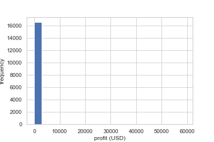
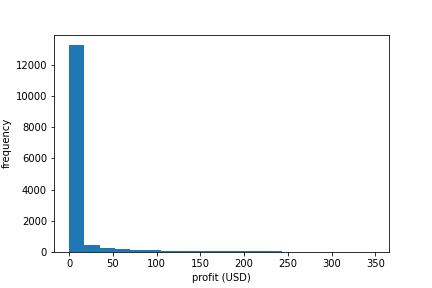
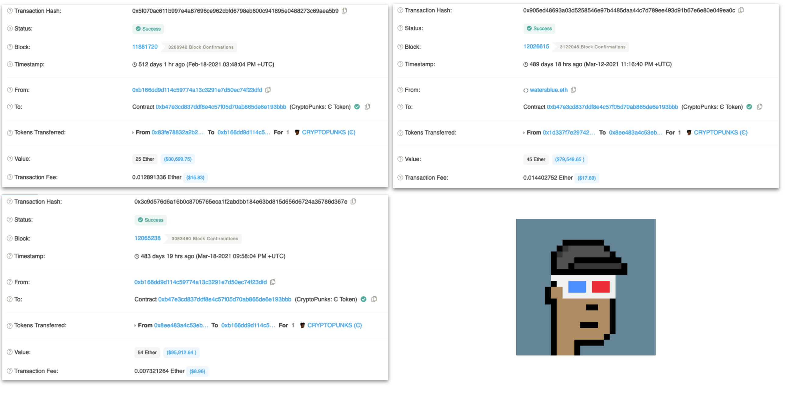
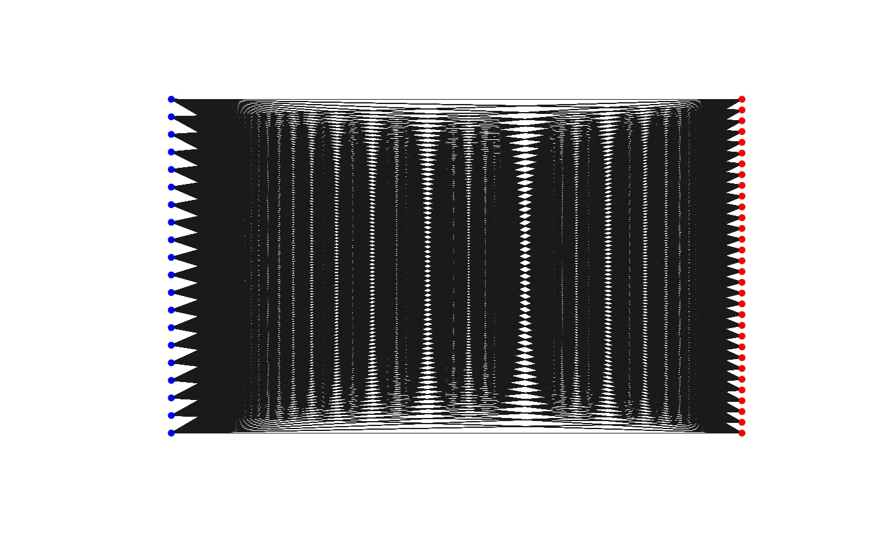

# What are NFTs? And Why NFTs?

A Non-fungible Token (NFT) is a digital asset, for example a digital version of the Mona Lisa artwork. These NFTs are stored on blockchain systems, one of which includes Ethereum. 

Anyone, including robots, can make, buy and sell NFTs. This is usually done with cryptocurrencies on marketplaces like OpenSea (this is an Ebay for NFTs) or directly between person to person. 

Above is the first NFT, "Quantum", created by Kevin McCoy. Since, many variants have arisen including Cryptokitties and Cryptopunks. The market saw a boon in 2021 which included the arrival of the Bored Ape Yacht Club. In 2021 the global market for NFTs was valued at $15.7 Billion USD. 

This has naturally attracted forms of crime, whereby on 1st June 2022 a former employee of an NFT market place was charged first ever suit of digital asset insider trading. A crime report from chainalysis recently revealed that 262 users have been participating in wash-trading their NFTs.  

But, what one should ask the question, how about other forms of patterns? Have users cycled NFTs between each other? Have they done this repeatedly? Is this money cycle widespread? 

We use Raphtory to investigate and analyse this phenomena. 

## Overview of the data

We used open data from the "Mapping the NFT revolution: market trends, trade networks, and visual features" paper. 
This dataset contains 4.7 million NFTs that in total were traded across 6.1 million transactions between June 23, 2017 and April 27, 2021. 

The data is pre-classified and contains transactions details for NFTs sales including the buyers, sellers, type of NFT, price and time. 
The NFT sales are spread across various tokens and cryptocurrencies. 
However, in some cases the price data in USD was unavailable, so we therefore chose to restrict our data to those traded with Ethereum. 

This left us with 2.3 million trades across 3,384 NFTs. 

| Smart_contract                             |   ID_token | Transaction_hash                                                   | Seller_address                             | Seller_username   | Buyer_address                              | Buyer_username   |   Price_Crypto | Crypto   |   Price_USD | Collection       | Market   |Datetime_updated_seconds   | Collection_cleaned   | Category    |
|:----|------:|:---------------|:---------|:--------|:--------|:---------|----------:|:---------|--------:|:-----------|:---------|:--------|:----|:-------|
| 0xd73be.. |   66733 | 0xcdb2c..  | 0xd0c23..  | GorillaNixon      | 0xf6362..  | iMott   |  0.008 | ETH      |     15.4833 | Blockchaincuties | OpenSea  |  | 2021-04-01 00:05:09  | Block   | Collectible |

Above is a small capture of a single row of data, that we have simplified by removing excess columns. In some cases, we noticed the USD price was missing which we had to obtained using average price of the day of the trade. 

## Modelling the data 

Prior research has analysed this data as a full network graph, however we want to take a different approach. 
For this dataset, we created a bipartite graph, with nodes being addresses and NFTs, and edges being sales (when a wallet purchases an NFT). 

Above is an example of a bipartide graph. 
On the left we have Ethereum wallets, the right NFTs, and the edges are purchases. 
The first wallet purchased two NFTs, each at blocktime of 1. 
We can see that the second wallet, purchased the card NFT at block 2, for 2 ETH.
And finally, the 3rd wallet bought a cryptokitty at blocktime 4 for 1.1 ETH. 

Whats interesting here is that the card game NFT, was purchased by two users.
First by wallet 1, and then by wallet 2. This means that wallet 1 sold the card NFT for 2ETH, effectively making a profit of 0.8 ETH. 

Why do we model the data like this? Well Raphtory is a node centric analytics system. 
We go through nodes, extract their edge history, send messages between nodes and perform analytics. 
In this case, we can take each node that is an NFT, and go through each time someone bought this NFT. 

There are other ways we could model the data, for example nodes sending edges to other nodes when they purchased NFTs, but then we would have to keep the NFT data on the edge. Or, we could have wallets have an edge to an NFT, whom has another edge to the next buyer. But then this would be confusing and cause our graph to be more complicated. 

# Ingesting the data with a GraphBuilder

Now we understand our data and know how we are going to model it. 
We will turn this into a graph and create our own `GraphBuilder`. 

In Raphtory, GraphBuilders are responsible for turning data into network graphs. 

In our data, each row contains a transaction. This transaction states the buyer, seller, NFT, time and the financial cost. 

Raphtory is a distributed system and the GraphBuilder too is apart of this distributed model. 
It does not keep track of nodes and edges it has previously seen.
Therefore, for each row, we have to tell the GraphBuilder exactly what to add, as if it has not seen it before. 

For our case, we want to tell the GraphBuilder that for each row we will: 

* Buyer node -> send an `addVertex` message to saw we have seen a Buyer
* Seller node -> (since we arent drawing edges for sellers we can ignore the seller node)
* NFT -> send an `addVertex` message, to say we have seen an NFT
* Purchase transaction -> send an `addEdge` message to say we have seen a Buyer purchased an NFT

For each of these messages, we will also send properties, such as the time they happened,  the purchase price, the Ethereum Transaction hash etc.  

# Writing a Cycle detection algorithm

Now we have loaded our data into a graph, we can do some analysis using built-in Raphtory algorithms or write our own. Lets write a cycle detection algorithm. 

Our `cycle` is defined as follows:

    1. Alice owns an NFT(cat)
    2. Alice sells her NFT(cat) to someone else
    3. After some time, Alice repurchases her NFT(cat) at a higher price than she sold it.

Earlier, we designed our model to be a Bipartide graph, with `NFTs` and `Wallets`, where edges are `Transactions` that indicate a purchase. 

To find these cycles, we can 

   1. go through each `NFT` and get all of its edges
   2. Check the `buyer` of each transaction 
   3. Check to see if any user had bought the same NFT twice

For the code you can view the `CycleMania.scala` file on GitHub.

# Results

We begin with some simple stats. 
After running this algorithm we identified 16,673 cycles whereby the user had purchased the NFT at a higher price than before, we can call this an `appreciation`

## Frequency of profits between NFT trades (over all time)

First, we look at the distribution, to identify how the data is skewed.

Clearly the data is heavily skewed, so a small trim of the top and bottom most 5% shows
that even still the data is skewed. 

The results show that about over 90% of cycles had NFTs appreciate by at most 80 USD.  

## Longest cycle (in terms of users that traded that NFT)

The longest cycle found was an NFT (ID: 108489 of Lucid Sight MLB) traded over 206 times. 
This specific NFT started with the buyer [0xe7387..](0xe738725cdcc41c91f734dd7b5b9659df994d6dda).
Who originally purchased said NFT for ~22.68 USD (0.1296 Ether) for the [first time](0x9566c93f3d4ee06fbd20982ce5ea6d7acf64d3f1cf1c74d2dcf450d24052791f) and after 44 days, repurchased 
this NFT for ~26.24 USD (0.1296 Ether). 

But given the large amount of time between their first and last purchase, and the low profit. 
Does not indicate suspicious activity. 

## Highest cost cycles (: NFTs that worth the most profit)

### 1
By sorting the data for the cycles with the largest gains. 
We find that address '0x87' purchased 500 Rarible[6929] for 165 ETH. 
However this is a quantity of a specific NFT.
Upon each transaction, the users each purchase different amounts of this token. 
Therefore the cycle is incorrect, as he later purchases 1020 of this token
which is why the quantity increases. These are multiples of the same token. 
BUSTED. 

'''
   0, B: 0x87.. $56942.325(0.0) 0x8530cee364e3aa98c5c1c4cef849dbe0780dfdb8d9a9b4674d22837028312084
->628, B: 0x89.. $1138.8465000000006(-55803.4785) 0xb805851908065988cb9c1747c8693e396d22432024e951b5133be7ff5ea8053a
->2218, B: 0x93.. $4555.386000000001(-52386.939) 0x5cd83126cc066245a1da552c7f6f97f0537ac8d705838d1010f74432cdd8c6fd
->2418, B: 0x49.. $113.88465(-56828.44035) 0xa2de576299276233ce73cc62494f93150c0efbda23ffaf9be80a5e75ba88a378
->2853, B: 0xd3.. $113.88465(-56828.44035) 0x14f8867198a82fb96bc63a4eff8dcce46d49a17ef92200b2bf89d17d2a9dfb92
->2854, B: 0x42.. $341.65395(-56600.67105) 0x2f6ef591fb1a2da6a8a27edc56b088ab9104aa77063099cfb72d82e67125eb99
->3479, B: 0x87.. $116162.343(59220.018) 0x6401d73024c774a98789d7745fd7e70eeb8b43f86ede0d64438409e83023e5eb
''' 

##### Okay so Rari token is claiming the top NFTs, so im gna delete all Rari token cycles

### 1

One of the interesting hops identified is of a user who purchased a Cryptopunk 8033 
for 25 ETH ($48,490 USD), held it for about 22 days before selling it for 45 ETH ($79.459 USD)
and then purchased it back after 6 days for 54 ETH ($95,912 USD). 

## Shot evaluation

Looking at the data further, we find that of our 352 traders, 322 traders (~91.48%) had conducted 4 or less cycles of trades. 
10 traders, ~2.84% of traders, conducted between 4 and 14 overall. 
20 traders, ~5.68% of traders, conducted between 528 and 617 cycles overall. 

Lets take a look the top whale in terms of involvement in cycles.

# One of the large Whales

In our dataset we found that trader '0x8acc1421ec98689461ff5777de8ad6648dc6d643' 
was involved in 617 cycles, making a total profit of ~$1,389 USD, with an average profit of $2.25 USD per trade. 

The trader swapped 32 NFTs belonging to Etheremon, Cryptokitties and Mlbchampion.

By looking further into his cycles, we find that the 32 NFTs they traded were swapped between 20 wallets 
across 12,874 transactions. 

By comparing the temporal element, of each transaction within the cycle, we identified that over 88% of transactions occurred within 3.4 hours to 4.6 hours apart. 

For example below we've simplified the transactions of NFT Ethermon #34508 being traded between these wallets. 
We've calculated the time delta between each transaction. 

First Buy   - 0x2c14a11af2efcd71ecbf6e391f423d8d82a719d12cd38a78cb6cfcb8911647e8
Delta  3.9h - 0x578603b33e4ab6d6402a87e9c096d0b9c6ba345caf168ae580fab88f487844c2
Delta  4.0h - 0x8ca90485db647c962d65be927b7235efd06b1f50c3766cd99f8b36fa7d1cadd5
Delta  3.9h - 0x6bd619cd1568f54c2c8567fcd4d2095e4ae0d1d6825c85cdcb252e9712f6cd71
Delta  3.9h - 0xf5b233b07db48da23f4d52e34b6128dd45d81db3fc4581cd126edf234ade931a
Delta  3.9h - 0x2002b28210f7ac948a4154e76a6fe6f48d23c6527476554c8d165cea90543b49
Delta  4.0h - 0xc7526f495bde6bfa21dd89bc091043ffdeaa77d39e43d737d189ac5c7d714598
Delta  3.9h - 0x5b6089495d305313d193bf4805ac68cf53bfa770c443ed3565656cde51722673
Delta  4.0h - 0x97484bbaa9c47a9b62b4d221248c1ccbd5902bca58176bf1df3cac57bb99e1c4

## As a network graph.

If we plot all of the transactions, and the trades between the Whales wallets and NFTs we 
create the graph below.
This indicates a clear connection, seeing that each of the other wallets also traded the other
NFTs in the whales collection. 

## Are there any siblings?

Our dataset consisted of 19 other Whales, Upon repeat analysis we discovered that they too 
followed the same patterns, whereby purchasing and trading NFTs between the same groups of 
wallets, with the same 3-4 hour time window. 

# Future works 

- This work used old datasets 
- Identifying proof of pumps and dumps, so these whales then sell the NFTs to users outside of their community?

# References

https://www.cryptokitties.co/

https://www.larvalabs.com/cryptopunks

https://boredapeyachtclub.com/ 

https://www.globenewswire.com/en/news-release/2022/05/26/2451426/0/en/The-Global-Non-Fungible-Tokens-NFTs-Market-is-expected-to-reach-a-value-of-USD-122-43-Billion-by-2028-at-a-CAGR-of-34-10-over-the-forecast-period-2022-2028-SkyQuest-Technology.html

https://www.justice.gov/usao-sdny/pr/former-employee-nft-marketplace-charged-first-ever-digital-asset-insider-trading-scheme

https://blog.chainalysis.com/reports/2022-crypto-crime-report-preview-nft-wash-trading-money-laundering/

Nadini, M., Alessandretti, L., Di Giacinto, F. et al. Mapping the NFT revolution: market trends, trade networks, and visual features. Sci Rep 11, 20902 (2021). https://doi.org/10.1038/s41598-021-00053-8