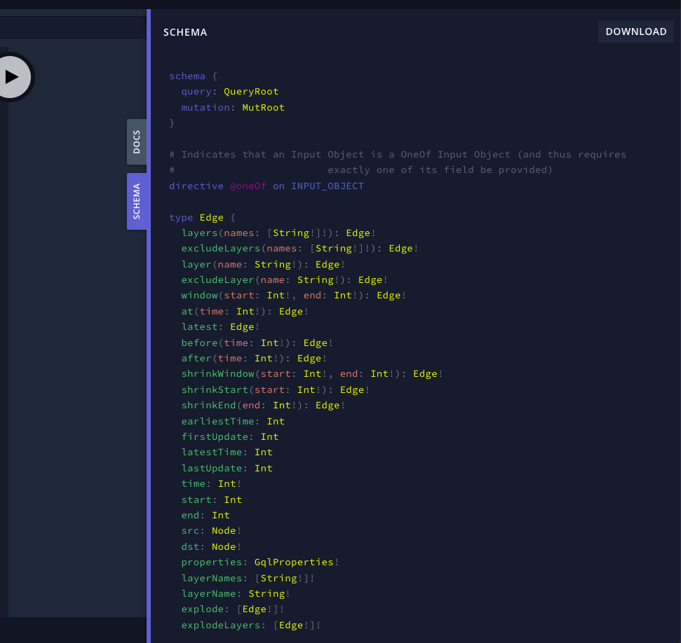
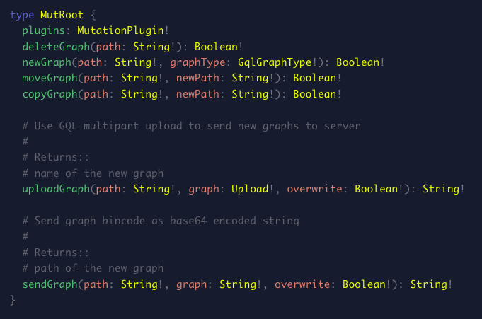

# Writing Raphtory queries in GraphQL

Once you have started your GraphQL server, you will be able to find your GraphQL UI in the browser via the port that you set.

The schema for the queries can be found on the right hand side in a pull out toggle.


## Example Queries in GraphQL

Here are some example queries to get you started:

Query to show list of all the nodes

```
query {
  	graph(path: "your_graph") {
    	nodes {
            list {
                name
            }
        }
    }
}
```

Query to show list of all the edges, with node properties `age`.

```
query {
  	graph(path: "your_graph") {
    	edges {
       	    list {
                src {
                    name
                    properties {
                        get(key:"age") {
                            value
                        }
                    }
                }
                dst {
                    name
                    properties {
                        get(key:"age") {
                            value
                        }
                    }
                }
            }
        }
    }
}
```

This will return something like this:

```
{
  "data": {
    "graph": {
      "edges": {
        "list": [
          {
            "src": {
              "name": "Ben",
              "properties": {
                "get": {
                  "value": 30
                }
              }
            },
            "dst": {
              "name": "Hamza",
              "properties": {
                "get": {
                  "value": 30
                }
              }
            }
          },
        ]
      }
    }
  }
}
```

All the queries that can be done in Python can also be done in GraphQL.

Here is an example:

=== ":fontawesome-brands-python: Python"

    ``` python
    g.node("Ben").properties.get("age")

    ```

=== " GraphQL"

    ``` graphql
    query {
        graph(path: "your_graph") {
            node(name: "Ben") {
                properties {
                    get(key: "age") {
                        value
                    }
                }
            }
        }
    }
    ```

## Querying GraphQL in Python

It is possible to send GraphQL queries in Python without the in-browser IDE. This can be handy if you would like to update your Raphtory graph in Python. Here is some example code that shows you how to do this with the Raphtory client:

```python
with GraphServer(work_dir).start():
    client = RaphtoryClient("http://localhost:1736")

    query = """{graph(path: "graph") { created lastOpened lastUpdated }}"""
    result = client.query(query)
```

Simply pass your graph object string into the client.query() method to execute the GraphQL query and retrieve the result in a python dictionary object.

```python
{'graph': {'created': 1729075008085, 'lastOpened': 1729075036222, 'lastUpdated': 1729075008085}}
```

## Mutation Queries

In GraphQL, you can write two different types of queries - a query to search through your data or a query that mutates your data.

The examples in the previous section are all queries used to search through your data. However in our API, you are also able to mutate your graph. This can be done both in the GraphQL IDE and in Python.

The schema in the GraphQL IDE shows how you can mutate the graph within the IDE:


There are additional methods to mutate the graph exclusively in Python such as sending, receiving and updating a graph, these will all be explained below.

## Sending a graph

You can send a graph to the server and overwrite an existing graph if needed.

=== ":fontawesome-brands-python: Python"

    ```python
    tmp_work_dir = tempfile.mkdtemp()
    with GraphServer(tmp_work_dir).start():
        client = RaphtoryClient("http://localhost:1736")

        g = Graph()
        g.add_edge(1, "bob", "emma")
        g.add_edge(2, "sally", "tony")
        client.send_graph(path="g", graph=g, overwrite=True)
    ```

To check your query:

```python
  query = """{graph(path: "g") {nodes {list {name}}}}"""
  client.query(query)
```

This should return:

```python
{
    "graph": {
        "nodes": {
            "list": [
                {"name": "bob"},
                {"name": "emma"},
                {"name": "sally"},
                {"name": "tony"},
            ]
        }
    }
}
```

## Receiving graphs

You can receive graphs from a "path" from the server. From this, you will get a Python Raphtory graph object back from the server.

```python
 g = client.receive_graph("path/to/graph")
 g.edge("sally", "tony")
```

## Creating a new graph

This is an example of how to create a new graph in the server.

The first parameter is the path of the graph to be created and the second parameter is the type of graph that should be created, this will either be _EVENT_ or _PERSISTENT_.
An explanation of the different types of graph can be found [here](../../user-guide/persistent-graph/1_intro.md)

=== " GraphQL"

    ```graphql
    mutation {
        newGraph(path: "new_graph", graphType: PERSISTENT)
    }
    ```

=== ":fontawesome-brands-python: Python"

    ```python
    work_dir = tempfile.mkdtemp()
    with GraphServer(work_dir).start():
        client = RaphtoryClient("http://localhost:1736")
        client.new_graph("path/to/new_graph", "EVENT")
    ```

The returning result to confirm that a new graph has been created:

```graphql
{
  "data": {
    "newGraph": true
  }
}
```

## Moving a graph

It is possible to move a graph to a new path on the server.

=== " GraphQL"

    ```graphql
    mutation {
        moveGraph(path: "graph", newPath: "new_path")
    }
    ```

=== ":fontawesome-brands-python: Python"

    ```python
    work_dir = tempfile.mkdtemp()
    with GraphServer(work_dir).start():
        client = RaphtoryClient("http://localhost:1736")
        client.move_graph("path/to/graph", "path/to/new_path)
    ```

The returning GraphQL result to confirm that the graph has been moved:

```graphql
{
  "data": {
    "moveGraph": true
  }
}
```

## Copying a graph

It is possible to copy a graph to a new path on the server.

=== " GraphQL"

    ```graphql
    mutation {
        copyGraph(path: "graph", newPath: "new_path")
    }
    ```

=== ":fontawesome-brands-python: Python"

    ```python
    work_dir = tempfile.mkdtemp()
    with GraphServer(work_dir).start():
        client = RaphtoryClient("http://localhost:1736")
        client.copy_graph("path/to/graph", "path/to/new_path)
    ```

The returning GraphQL result to confirm that the graph has been copied:

```graphql
{
  "data": {
    "copyGraph": true
  }
}
```

## Deleting a graph

It is possible to delete a graph on the server.

=== " GraphQL"

    ```graphql
    mutation {
        deleteGraph(path: "graph")
    }
    ```

=== ":fontawesome-brands-python: Python"

    ```python
    work_dir = tempfile.mkdtemp()
    with GraphServer(work_dir).start():
        client = RaphtoryClient("http://localhost:1736")
        client.delete_graph("graph")
    ```

The returning GraphQL result to confirm that the graph has been deleted:

```graphql
{
  "data": {
    "deleteGraph": true
  }
}
```

## Updating the graph

It is possible to update the graph using the `remote_graph()` method.
=== ":fontawesome-brands-python: Python"

    ```python
    work_dir = tempfile.mkdtemp()
        with GraphServer(work_dir).start():
            client = RaphtoryClient("http://localhost:1736")
            client.new_graph("path/to/event_graph", "EVENT")
            rg = client.remote_graph("path/to/event_graph")
            rg.add_edge(1, "sally", "tony", layer="friendship")
    ```

Once you have updated the graph such as adding an edge, adding a node, removing an edge etc. You can receive a graph using `receive_graph()` and stating the path of the graph you would like to receive.

=== ":fontawesome-brands-python: Python"

    ```python
    g = client.receive_graph("path/to/event_graph")
    ```

## Batch updates

If you would like to add multiple nodes or edges to your graph, this is possible via the add_edges() or add_nodes() methods.

=== ":fontawesome-brands-python: Python"

    ```python
    work_dir = tempfile.mkdtemp()
        with GraphServer(work_dir).start():
            client = RaphtoryClient("http://localhost:1736")
            client.new_graph("path/to/event_graph", "EVENT")
            rg = client.remote_graph("path/to/event_graph")
            rg.add_edges()
    ```
